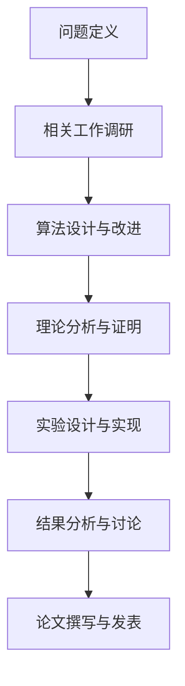

# 分布式机器学习与联邦学习研究项目  
**基于真实数据的算法优化与应用实践**  

## 项目概述  
本项目聚焦于分布式机器学习（Distributed ML）与联邦学习（Federated Learning）的前沿研究，旨在探索如何在数据隐私保护与计算效率之间取得平衡。项目基于真实数据集，通过理论分析与实验验证相结合的方式，研究随机优化算法、联邦学习框架及其在实际场景中的应用改进。  

### 研究背景  
随着数据隐私法规（如GDPR、CCPA）的日益严格，传统集中式机器学习面临数据孤岛与隐私泄露挑战。联邦学习作为一种新兴范式，允许在不共享原始数据的前提下协同训练模型，为解决这一问题提供了有效途径。然而，联邦学习在通信效率、模型收敛性和安全性等方面仍存在诸多待解决的研究问题。


## 研究目标  
1. **算法优化**：改进联邦学习算法，提升收敛速度和模型性能。  
2. **隐私保护**：研究差分隐私、同态加密等技术在联邦学习中的应用。  
3. **应用实践**：将分布式学习算法应用于医疗、自动驾驶、物联网等领域。  
4. **理论分析**：建立随机优化算法的收敛性理论，为算法设计提供理论支持。  


## 研究方法与技术路线  
### 1. 理论基础  
- 随机梯度下降（SGD）及其变种（Adagrad、Adam、RMSProp）  
- 分布式优化理论（一致性优化、去中心化学习）  
- 联邦学习框架（FedAvg、FedProx、SCAFFOLD等）  

### 2. 实验平台  
- **编程语言**：Python  
- **机器学习框架**：PyTorch, TensorFlow, scikit-learn  
- **分布式计算**：MPI, Horovod, Flower  
- **数据隐私工具**：Opacus, TF Privacy  

### 3. 研究流程  



## 研究成果  
### 1. 核心代码实现  
- 分布式机器学习框架搭建  
- 联邦学习算法对比实验（FedAvg vs. FedProx vs. SCAFFOLD）  
- 随机优化算法性能评估  

### 2. 实验数据集  
- **医疗数据**：糖尿病预测、癌症诊断（使用合成数据或经过脱敏处理的真实数据）  
- **自动驾驶**：交通标志识别、目标检测  
- **物联网**：传感器数据异常检测  

### 3. 关键发现  
- 不同联邦学习算法在通信效率与模型精度之间的权衡  
- 数据异质性对联邦学习性能的影响分析  
- 随机优化算法超参数调优策略  


## 项目结构  
```
distributed-ml-research/
├── data/                  # 数据集（说明获取方式，避免上传敏感数据）
├── src/                   # 源代码
│   ├── algorithms/        # 联邦学习算法实现
│   ├── experiments/       # 实验脚本
│   ├── models/            # 机器学习模型定义
│   └── utils/             # 辅助工具函数
├── notebooks/             # Jupyter实验笔记
├── results/               # 实验结果与可视化
├── docs/                  # 文档（研究报告、演示幻灯片）
└── README.md              # 项目说明
```


## 如何参与  
### 1. 环境配置  
```bash
# 创建虚拟环境
conda create -n fl-research python=3.9
conda activate fl-research

# 安装依赖
pip install -r requirements.txt
```

### 2. 运行实验  
```bash
# 示例：运行联邦学习对比实验
python src/experiments/fedavg_vs_fedprox.py --dataset cifar10 --clients 10 --rounds 50
```

### 3. 贡献代码  
1. Fork本仓库  
2. 创建新分支：`git checkout -b feature/new-algorithm`  
3. 提交代码：`git commit -m "Add new federated learning algorithm"`  
4. 推送分支：`git push origin feature/new-algorithm`  
5. 发起Pull Request  


## 研究团队  
- **负责人**：HongyiHao-SXIT (https://github.com/HongyiHao-SXIT)  
- **贡献者**：[列出团队成员或贡献者GitHub账号]  


## 引用与致谢  
如果您使用本项目的代码或研究成果，请引用以下文献（待补充）：  
```bibtex
@article{your-paper,
  title={Distributed Machine Learning for Privacy-Preserving Data Analysis},
  author={Your Name, et al.},
  journal={arXiv preprint arXiv:xxxx.xxxx},
  year={2025}
}
```

感谢[课程名称/资助机构]的支持！  


## 许可证  
本项目采用[许可证类型]许可证 - 详情见[LICENSE](LICENSE)文件。  


**科研诚信声明**：本项目严格遵守学术道德规范，尊重他人知识产权，所有实验数据和结果均可复现。